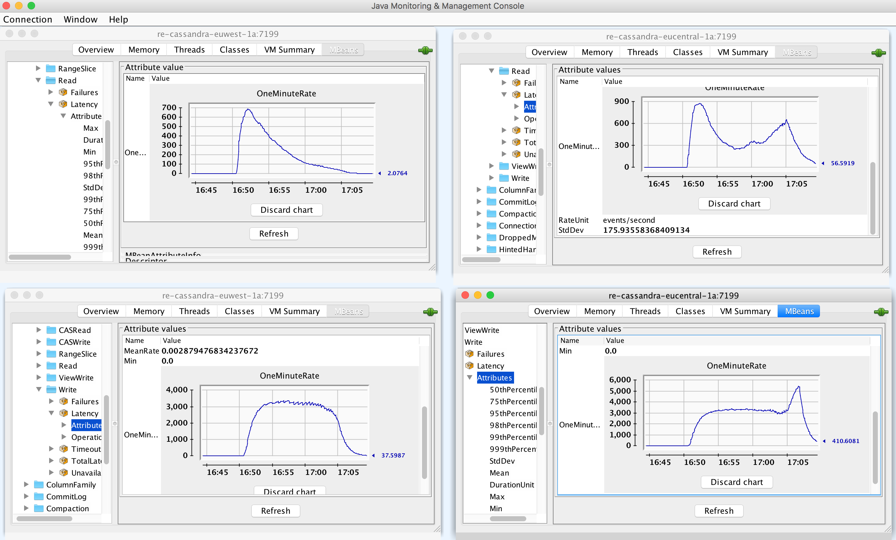

2DCs
3 C* nodes per DC
3 Akka nodes per DC

1000 updates to a single counter
time curl -v "localhost:8080/single-counter-test?counter=chris&updates=1000"

Replicated successfully to both DCs 

Produces 2k writes as expected:

```
cqlsh:akka> select count(*) from messages;

 count
-------
  2000

(1 rows)
```

Latency on the read table (single partition read is negligible):

```
ubuntu@ip-172-31-45-92:~$ nodetool cfhistograms  akka messages_notification                                
No SSTables exists, unable to calculate 'Partition Size' and 'Cell Count' percentiles                      
akka/messages_notification histograms                
Percentile  SSTables     Write Latency      Read Latency    Partition Size        Cell Count               
                              (micros)          (micros)           (bytes)                                 
50%             0.00             17.08             35.43               NaN               NaN               
75%             0.00             20.50             42.51               NaN               NaN               
95%             0.00             20.50             88.15               NaN               NaN               
98%             0.00             20.50            105.78               NaN               NaN               
99%             0.00             20.50            105.78               NaN               NaN               
Min             0.00             11.87              5.72               NaN               NaN               
Max             0.00             20.50            315.85               NaN               NaN             
```

Second 1000 writes to the same counter, monitoring cfstats on a single node:

Before:

```
Keyspace: akka
        Read Count: 10324198
        Read Latency: 0.25709201131167764 ms.
        Write Count: 8857654
        Write Latency: 0.03076243427435752 ms.
        Pending Flushes: 0

```

After:

```
Keyspace: akka
        Read Count: 10326317
        Read Latency: 0.257049715789279 ms.
        Write Count: 8859665
        Write Latency: 0.030769769624472258 ms.
```

2011 writes. Most to the messages table and a few to the notifications table.

2119 reads. Hrmmmmm. 

Messages table:

Before:
```
  Local read count: 10258913
  Local read latency: 0.028 ms
  Local write count: 8849462
  Local write latency: 0.020 ms
```

After:
```
Local read count: 10260950
Local read latency: 0.061 ms
Local write count: 8851466
Local write latency: 0.094 ms

```

So nearly all on the messages table. This must be rows read.

Attaching JConsole to a Cassandra node:

Running 3000 counters updated in 1 DC 2000 times, acking each increment before doing the next.

Cassandra writes settle at 2.5/node.

Reads end up ~1500/s per node for 3000 active entities in one DC.

This was a bug. Reads down to about 100/node.

Next test was doing the same 3k entities in both DCs and incrementing them all 1k times. 

This causes a lot of:

```
java.lang.IllegalStateException: Missing sequence number [3942], got [3943] for persistenceId [counter|2057|eu-central].                                                                                              
        at akka.persistence.cassandra.query.EventsByPersistenceIdStage$$anon$1.akka$persistence$cassandra$query$EventsByPersistenceIdStage$$anon$$tryPushOne(EventsByPersistenceIdStage.scala:323)                    
        at akka.persistence.cassandra.query.EventsByPersistenceIdStage$$anon$1.onPull(EventsByPersistenceIdStage.scala:280) 
```

But it all recovers without intervention and all counters ended up up to date.

Next, switch to artery and repeat.


# ktoso -- 1DC, split brain testing

1DC
3 cassandra nodes
3 akka nodes

# patriknw

## 2017-12-14 21:00

Long running test (8h), emitting 10 events every 10 seconds.

* 2 DCs
* 3*2 Cassandra nodes
* 1 Akka node

Pre:

```
drop table akka.messages;
drop table akka.metadata;
drop table akka.messages_notification;
drop table akka_snapshot.snapshots;
```

Run:

```
sbt -Dsbt.log.noformat=true "multidc/runMain com.lightbend.multidc.ReplicatedEntityApp" > log3.txt
```

```
for i in {1..3000}; do
  curl -v "localhost:8080/test?counters=1&updates=10"
  sleep 10
  curl "localhost:8080/counter?id=0"
done
```

cat log3.txt | egrep "(ERROR|UNREACHABLE|growing)"

**re-cassandra-euwest-1a**

JMX 
* Read  OneMinuteRate: 1.4 events/s
* Write OneMinuteRate: 0.3 events/s

nodetool cfstats akka.messages akka.messages_notification -H | egrep "(Table: messages|Local read|Local write)"

```
		Table: messages
		Local read count: 3464
		Local read latency: NaN ms
		Local write count: 58572
		Local write latency: NaN ms
		Table: messages_notification
		Local read count: 67881
		Local read latency: NaN ms
		Local write count: 5639
		Local write latency: NaN ms
```

select count(*) from akka.messages: 58572
select count(*) from akka.messages_notification: 5639

**re-cassandra-eucentral-1a**
 
nodetool cfstats akka.messages akka.messages_notification -H | egrep "(Table: messages|Local read|Local write)"

```
		Table: messages
		Local read count: 9
		Local read latency: NaN ms
		Local write count: 58575
		Local write latency: NaN ms
		Table: messages_notification
		Local read count: 60
		Local read latency: NaN ms
		Local write count: 5640
		Local write latency: NaN ms
```

select count(*) from akka.messages: 58572
select count(*) from akka.messages_notification: 5639

**Issues**

Couldn't create new keyspace. (log2.txt)

```
[info] 18:28:25.592 [MultiDcSystem-worker-0] WARN  c.d.d.c.Cluster - No schema agreement from live replicas after 10 s. The schema may not be up to date on some nodes.
[info] 18:28:25.592 [MultiDcSystem-worker-2] DEBUG c.d.d.c.ControlConnection - [Control connection] Refreshing schema for akka2.messages_notification (TABLE)
[info] 18:28:25.603 [MultiDcSystem-nio-worker-2] DEBUG c.d.d.c.RequestHandler - [2144489851-1] Doing retry 1 for query
[info]       SELECT * FROM akka2.config
[info]      at consistency null
[info] 18:28:25.603 [MultiDcSystem-nio-worker-2] DEBUG c.d.d.c.RequestHandler - [2144489851-1] Error querying /34.242.227.97:9042 : com.datastax.driver.core.exceptions.UnavailableException: Not enough repli
cas available for query at consistency LOCAL_ONE (1 required but only 0 alive)
[info] 18:28:25.606 [MultiDcSystem-nio-worker-2] DEBUG c.d.d.c.Q.ERROR - [MultiDcSystem] [/34.242.227.97:9042] Query error after 2 ms: [0 bound values] SELECT * FROM akka2.config;
[info] com.datastax.driver.core.exceptions.UnavailableException: Not enough replicas available for query at consistency LOCAL_ONE (1 required but only 0 alive)
```

Trying to register to coordinator.

```
[info] 07:02:13.770 [MultiDcSystem-akka.actor.default-dispatcher-11] WARN  a.c.s.ShardRegion - Trying to register to coordinator at [None], but no acknowledgement. Total [53400] buffered messages.
```

Probably because of speculative-replication = on, but no Akka node started in other DC.

CoordinatedShutdown doesn't complete `Performing phase [cluster-sharding-shutdown-region]`, and it doesn't timeout.
Could it be because of the proxies that couldn't register to other DC?

ConfigChecker:
akka.cluster.multi-data-center.speculative-replication.enabled is not an Akka configuration setting

## 2017-12-15 10:40

Just restarting the Akka node to verify replay of events from previous test.

* 2 DCs
* 3*2 Cassandra nodes
* 1 Akka node
* speculative-replication = on

Run:

```
sbt -Dsbt.log.noformat=true "multidc/runMain com.lightbend.multidc.ReplicatedEntityApp" > log4.txt
```

```
curl -v "localhost:8080/test?counters=1&updates=1"

curl "localhost:8080/counter?id=0"
```

All good. 72 "Replayed own replicated event"

## 2017-12-15 11:00

Updating one counter 1000 times from one side.

* 2 DCs
* 3*2 Cassandra nodes
* 1*2 Akka nodes
* speculative-replication = on

Pre: drop tables

Run:

```
sbt -Dsbt.log.noformat=true "multidc/runMain com.lightbend.multidc.ReplicatedEntityApp" > log6.txt
```

```
curl -v "localhost:8080/single-counter-test?counter=pn1&updates=1000"

curl "localhost:8080/counter?id=pn1"
```

All good. Counter at 1000 on both sides.

**re-cassandra-euwest-1a**

nodetool cfstats akka.messages akka.messages_notification -H | egrep "(Table: messages|Local read|Local write)"

```
		Table: messages
		Local read count: 17
		Local read latency: NaN ms
		Local write count: 2000
		Local write latency: 0.023 ms
		Table: messages_notification
		Local read count: 359
		Local read latency: 0.031 ms
		Local write count: 8
		Local write latency: NaN ms
```

select count(*) from akka.messages: 2000
select count(*) from akka.messages_notification: 8

**re-cassandra-eucentral-1a**
 
nodetool cfstats akka.messages akka.messages_notification -H | egrep "(Table: messages|Local read|Local write)"

```
		Table: messages
		Local read count: 13
		Local read latency: NaN ms
		Local write count: 2000
		Local write latency: 0.023 ms
		Table: messages_notification
		Local read count: 336
		Local read latency: 0.039 ms
		Local write count: 8
		Local write latency: NaN ms
```

select count(*) from akka.messages: 2000
select count(*) from akka.messages_notification: 8

## 2017-12-15 11:50

Updating 3000 counters 2000 times from both sides.

* 2 DCs
* 3*2 Cassandra nodes
* 1*2 Akka nodes
* speculative-replication = off 

Pre: drop tables


Run:

```
sbt -Dsbt.log.noformat=true "multidc/runMain com.lightbend.multidc.ReplicatedEntityApp" > log7.txt
```

```
curl -v "localhost:8080/test?counters=3000&updates=2000"
```


**re-cassandra-euwest-1a**

nodetool cfstats akka.messages akka.messages_notification -H | egrep "(Table: messages|Local read|Local write)"

```
		Table: messages
		Local read count: 928258
		Local read latency: 0.141 ms
		Local write count: 9811004
		Local write latency: 0.026 ms
		Table: messages_notification
		Local read count: 2624
		Local read latency: 9.744 ms
		Local write count: 10726
		Local write latency: 0.023 ms
```

select count(*) from akka.messages: request timeout
select count(*) from akka.messages_notification: 10726


**re-cassandra-eucentral-1a**
 
nodetool cfstats akka.messages akka.messages_notification -H | egrep "(Table: messages|Local read|Local write)"

```
		Table: messages
		Local read count: 564790
		Local read latency: 1.811 ms
		Local write count: 9810691
		Local write latency: 0.022 ms
		Table: messages_notification
		Local read count: 827
		Local read latency: 23.627 ms
		Local write count: 10726
		Local write latency: 0.021 ms
```

select count(*) from akka.messages: request timeout
select count(*) from akka.messages_notification: 10726

JMX Read and Write rate:


CPU euwest:


CPU eucentral:


**Issues**

The counters were increased to around 2445. Expected 4000.

Seems to be overloaded. No errors in logs.

Many (7371) "Query too slow" in eucentral, none in euwest:

```
[info] 11:21:59.455 DEBUG [c.d.driver.core.QueryLogger.SLOW] [] - [MultiDcSystem] [/54.93.225.104:9042] Query too slow, took 5025 ms: [2 bound values] SELECT sequence_nr, used FROM akka.messages WHERE
[info] 11:21:59.455 DEBUG [c.d.driver.core.QueryLogger.SLOW] [] - [MultiDcSystem] [/54.93.225.104:9042] Query too slow, took 5025 ms: [2 bound values] SELECT sequence_nr, used FROM akka.messages WHERE
[info] 11:21:59.455 DEBUG [c.d.driver.core.QueryLogger.SLOW] [] - [MultiDcSystem] [/54.93.225.104:9042] Query too slow, took 5026 ms: [1 bound values] SELECT deleted_to FROM akka.metadata WHERE
[info] 11:21:59.455 DEBUG [c.d.driver.core.QueryLogger.SLOW] [] - [MultiDcSystem] [/54.93.225.104:9042] Query too slow, took 5018 ms: [14 bound values] INSERT INTO akka.messages (persistence_id, partition_nr, sequence_nr, timestamp, timebucket, writer_uuid, ser_id, ser_manifest, event_manifest, event,
[info] 11:21:59.455 DEBUG [c.d.driver.core.QueryLogger.SLOW] [] - [MultiDcSystem] [/54.93.225.104:9042] Query too slow, took 5023 ms: [2 bound values] SELECT sequence_nr, used FROM akka.messages WHERE
[info] 11:21:59.455 DEBUG [c.d.driver.core.QueryLogger.SLOW] [] - [MultiDcSystem] [/54.93.225.104:9042] Query too slow, took 5018 ms: [14 bound values] INSERT INTO akka.messages (persistence_id, partition_nr, sequence_nr, timestamp, timebucket, writer_uuid, ser_id, ser_manifest, event_manifest, event,
[info] 11:21:59.456 DEBUG [c.d.driver.core.QueryLogger.SLOW] [] - [MultiDcSystem] [/54.93.225.104:9042] Query too slow, took 5023 ms: [14 bound values] INSERT INTO akka.messages (persistence_id, partition_nr, sequence_nr, timestamp, timebucket, writer_uuid, ser_id, ser_manifest, event_manifest, event,
[info] 11:21:59.456 DEBUG [c.d.driver.core.QueryLogger.SLOW] [] - [MultiDcSystem] [/54.93.225.104:9042] Query too slow, took 5017 ms: [14 bound values] INSERT INTO akka.messages (persistence_id, partition_nr, sequence_nr, timestamp, timebucket, writer_uuid, ser_id, ser_manifest, event_manifest, event,
[info] 11:21:59.456 DEBUG [c.d.driver.core.QueryLogger.SLOW] [] - [MultiDcSystem] [/54.93.225.104:9042] Query too slow, took 5016 ms: [14 bound values] INSERT INTO akka.messages (persistence_id, partition_nr, sequence_nr, timestamp, timebucket, writer_uuid, ser_id, ser_manifest, event_manifest, event, 
```

## 2017-12-15 15:00

Updating 500 counters 2000 times from both sides.

* 2 DCs
* 3*2 Cassandra nodes
* 1*2 Akka nodes
* speculative-replication = off 

Pre: drop tables

Run:

```
sbt -Dsbt.log.noformat=true -J-XX:+PrintGCDetails -J-XX:+PrintGCTimeStamps "multidc/runMain com.lightbend.multidc.ReplicatedEntityApp" > log8.txt
```

```
curl -v "localhost:8080/test?counters=500&updates=2000"
```


**re-cassandra-euwest-1a**

nodetool cfstats akka.messages akka.messages_notification -H | egrep "(Table: messages|Local read|Local write)"

```
		Table: messages
		Local read count: 59768
		Local read latency: 0.528 ms
		Local write count: 4000179
		Local write latency: 0.033 ms
		Table: messages_notification
		Local read count: 831
		Local read latency: 0.597 ms
		Local write count: 423
		Local write latency: 0.025 ms
```

select count(*) from akka.messages: request timeout
select count(*) from akka.messages_notification: 423

**re-cassandra-eucentral-1a**
 
nodetool cfstats akka.messages akka.messages_notification -H | egrep "(Table: messages|Local read|Local write)"

```
		Table: messages
		Local read count: 48137
		Local read latency: 0.623 ms
		Local write count: 4000157
		Local write latency: 0.030 ms
		Table: messages_notification
		Local read count: 766
		Local read latency: 0.910 ms
		Local write count: 423
		Local write latency: 0.023 ms
```

select count(*) from akka.messages: request timeout
select count(*) from akka.messages_notification: 423

JMX Read and Write rate:


CPU: ~ 50%

All good. Counters ended at 4000.


## 2017-12-15 15:20

Updating 1000 counters 2000 times from both sides.
Same as above.

Run:

```
curl -v "localhost:8080/test?counters=1000&updates=2000"
```

All good. Counters ended at 4000.

log10.txt


## 2017-12-15 16:00

Updating 2000 counters 2000 times from both sides.
Same as above.

Run:

```
sbt -Dsbt.log.noformat=true -J-Xms4g -J-Xmx4g -J-XX:+PrintGCDetails -J-XX:+PrintGCTimeStamps "multidc/runMain com.lightbend.multidc.ReplicatedEntityApp" > log8.txt
```

```
curl -v "localhost:8080/test?counters=2000&updates=2000"
```

**re-cassandra-euwest-1a**

nodetool cfstats akka.messages akka.messages_notification -H | egrep "(Table: messages|Local read|Local write)"

```
		Table: messages
		Local read count: 469834
		Local read latency: 0.955 ms
		Local write count: 16000477
		Local write latency: 0.033 ms
		Table: messages_notification
		Local read count: 1807
		Local read latency: 23.175 ms
		Local write count: 16605
		Local write latency: 0.039 ms
```

**re-cassandra-eucentral-1a**
 
nodetool cfstats akka.messages akka.messages_notification -H | egrep "(Table: messages|Local read|Local write)"

```
		Table: messages
		Local read count: 552916
		Local read latency: 2.069 ms
		Local write count: 16000641
		Local write latency: 0.039 ms
		Table: messages_notification
		Local read count: 1912
		Local read latency: 24.510 ms
		Local write count: 16605
		Local write latency: 0.036 ms
```

At first some trouble with full disk on some Cassandra instances, and full heap on some Akka nodes.
Increased heap size to 4G.
 
All good. Counters ended at 4000.

log12.txt


CPU: ~90 % on all nodes

## 2017-12-15 16:50

Updating 3000 counters 2000 times from both sides.
Same as above.

Run:

```
curl -v "localhost:8080/test?counters=3000&updates=2000"
```



Issues:

Seems overloaded

CPU: ~85 % on Cassandra nodes
CPU: ~95 % on Akka nodes


```
16:08:09.853 ERROR [a.p.m.internal.ReplicatedEntityActor] [MultiDcSystem-akka.actor.default-dispatcher-15] - [counter|1895|eu-west] [counter|1895|eu-west-replicationStream-eu-central] Upstream failed.
akka.pattern.AskTimeoutException: Ask timed out on [Actor[akka://MultiDcSystem/system/sharding/counter/95/1895#-161095793]] after [30000 ms]. Sender[Actor[akka://MultiDcSystem/system/sharding/counter/95/1895
#-161095793]] sent message of type "akka.persistence.multidc.internal.DirectlyReplicatedEventEnvelope".
```

```
16:08:12.972 ERROR [a.p.m.internal.ReplicatedEntityActor] [MultiDcSystem-akka.actor.default-dispatcher-10] - Failed to persist event type [akka.persistence.multidc.ReplicatedEvent] with sequence number [2577
] for persistenceId [counter|1801|eu-west].
akka.pattern.CircuitBreaker$$anon$1: Circuit Breaker Timed out. 
```

```
1334.898: [Full GC (Ergonomics) [PSYoungGen: 465920K->159176K(931840K)] [ParOldGen: 2796519K->2796392K(2796544K)] 3262439K->2955569K(3728384K), [Metaspace: 102652K->102652K(1136640K)], 5.8993515 secs] [Times: user=23.06 sys=0.00, real=5.90 secs]
1341.104: [Full GC (Ergonomics) [PSYoungGen: 465920K->173968K(931840K)] [ParOldGen: 2796392K->2796175K(2796544K)] 3262312K->2970143K(3728384K), [Metaspace: 102660K->102660K(1136640K)], 5.9873093 secs] [Times: user=23.39 sys=0.00, real=5.99 secs]
```

```
16:01:28.471 ERROR [a.r.a.ArteryTransport(akka://MultiDcSystem)] [MultiDcSystem-akka.actor.default-dispatcher-2] - Aeron error: 1 observations from 12/15/2017 16:01:10.024 to 12/15/2017 16:01:10.024 for:
 java.net.SocketException: Message too long
        at sun.nio.ch.DatagramChannelImpl.receive0(Native Method)
        at sun.nio.ch.DatagramChannelImpl.receiveIntoNativeBuffer(DatagramChannelImpl.java:414)
        at sun.nio.ch.DatagramChannelImpl.receive(DatagramChannelImpl.java:392)
        at sun.nio.ch.DatagramChannelImpl.receive(DatagramChannelImpl.java:345)
        at io.aeron.driver.media.UdpChannelTransport.receive(UdpChannelTransport.java:257)
        at io.aeron.driver.media.ControlTransportPoller.poll(ControlTransportPoller.java:136)
        at io.aeron.driver.media.ControlTransportPoller.pollTransports(ControlTransportPoller.java:78)
        at io.aeron.driver.Sender.doWork(Sender.java:93)
        at org.agrona.concurrent.CompositeAgent.doWork(CompositeAgent.java:79)
        at org.agrona.concurrent.AgentRunner.run(AgentRunner.java:140)
        at java.lang.Thread.run(Thread.java:748)
```

That is probably because I removed the forking and didn't run with `-Daeron.mtu.length=1024`

https://github.com/akka/akka-persistence-cassandra/issues/295

## 2017-12-15 17:30

Long running

* 2 DCs
* 3*2 Cassandra nodes
* 1*2 Akka nodes
* speculative-replication = off

Pre: drop tables

Run:

```
sbt -Daeron.mtu.length=1024 -Dsbt.log.noformat=true -J-Xms4g -J-Xmx4g -J-XX:+PrintGCDetails -J-XX:+PrintGCTimeStamps "multidc/runMain com.lightbend.multidc.ReplicatedEntityApp" > log14.txt
```

```
#!/bin/bash

for i in {1..9000}; do
  curl -v "localhost:8080/test?counters=100&updates=10"
  sleep 5
done
```

Disk full on Cassandra instances re-cassandra-euwest-1b, re-cassandra-euwest-1a. Small volumes, 83G, other instances have 67G.
Removed /var/lib/cassandra/* and restarted.

The Akka node in euwest reconnected successfully but I stopped the nodes. 

CPU: ~8 % on Cassandra nodes
CPU: ~16 % on Akka nodes

## 2017-12-16 10:30

Long running, 46 hours.

* 2 DCs
* 3*2 Cassandra nodes
* 1*2 Akka nodes
* speculative-replication = off

Pre: drop tables

Run:

```
sbt -Daeron.mtu.length=1024 -Dsbt.log.noformat=true -J-Xms4g -J-Xmx4g -J-XX:+PrintGCDetails -J-XX:+PrintGCTimeStamps "multidc/runMain com.lightbend.multidc.ReplicatedEntityApp" > log15.txt
```

```
#!/bin/bash

for i in {1..9000}; do
  curl -v "localhost:8080/test?counters=10&updates=3"
  sleep 10
done
```

Counters were updated to expected values: 9000*3*2 = 54000

Script was started again without restarting Akka and Cassandra nodes.

All good. 

CPU: ~1 % on Cassandra nodes
CPU: ~10 % on Akka nodes

## 2017-12-18 10:10

speculative-replication, updating one counter 1000 times from one side.

* 2 DCs
* 3*2 Cassandra nodes
* 1*2 Akka nodes
* speculative-replication = on

Pre: drop tables

Run:

```
sbt -Daeron.mtu.length=1024 -Dsbt.log.noformat=true -J-Xms4g -J-Xmx4g -J-XX:+PrintGCDetails -J-XX:+PrintGCTimeStamps "multidc/runMain com.lightbend.multidc.ReplicatedEntityApp" > log16.txt
```

```
curl -v "localhost:8080/single-counter-test?counter=pn1&updates=1"
curl -v "localhost:8080/single-counter-test?counter=pn1&updates=1"
curl -v "localhost:8080/single-counter-test?counter=pn1&updates=1"
curl -v "localhost:8080/single-counter-test?counter=pn1&updates=1000"

curl "localhost:8080/counter?id=pn1"
```

Verified logs that keep-alive woke up the entity on other side.
Verified logs that speculative events were received.

All good. Counter at 1003 on both sides.

Run same again with `speculative-replication = off` and verified:

```
cat log16b.txt |grep "Received replicated event"|wc -l
1003

cat log16.txt |grep "Received replicated event"|wc -l
0
```

## 2017-12-18 10:30

speculative-replication, updating 2000 counters 2000 times from one side.

* 2 DCs
* 3*2 Cassandra nodes
* 1*2 Akka nodes
* speculative-replication = on

Pre: drop tables

Run:

```
sbt -Daeron.mtu.length=1024 -Dsbt.log.noformat=true -J-Xms4g -J-Xmx4g -J-XX:+PrintGCDetails -J-XX:+PrintGCTimeStamps "multidc/runMain com.lightbend.multidc.ReplicatedEntityApp" > log17.txt
```

```
curl -v "localhost:8080/test?counters=2000&updates=2000"
```

**re-cassandra-euwest-1a**

nodetool cfstats akka.messages akka.messages_notification -H | egrep "(Table: messages|Local read|Local write)"

```
		Table: messages
		Local read count: 1851944
		Local read latency: 0.238 ms
		Local write count: 8001728
		Local write latency: 0.020 ms
		Table: messages_notification
		Local read count: 2859
		Local read latency: 7.698 ms
		Local write count: 8511
		Local write latency: 0.030 ms
```

**re-cassandra-eucentral-1a**
 
nodetool cfstats akka.messages akka.messages_notification -H | egrep "(Table: messages|Local read|Local write)"

```
		Table: messages
		Local read count: 212244
		Local read latency: 0.187 ms
		Local write count: 8000281
		Local write latency: 0.021 ms
		Table: messages_notification
		Local read count: 3213
		Local read latency: 9.251 ms
		Local write count: 8511
		Local write latency: 0.030 ms
```

**Issues**

Too many reads.

west:

```
cat log17.txt |grep "Received replicated event"|wc -l
4000000

cat log17.txt |grep "Received speculatively replicated event"|wc -l
4000000
```

central:

```
cat log17.txt |grep "Received replicated event"|wc -l
43138

cat log17.txt |grep "Received speculatively replicated event"|wc -l
3956862
```

It's because missing fastForward when receiving own speculative event.

https://github.com/lightbend/akka-commercial-addons/issues/293

## 2017-12-18 11:20

Network partitions

* 2 DCs
* 3*2 Cassandra nodes
* 1*2 Akka nodes
* speculative-replication = on

Pre: drop tables

Run:

```
sbt -Daeron.mtu.length=1024 -Dsbt.log.noformat=true -J-Xms4g -J-Xmx4g -J-XX:+PrintGCDetails -J-XX:+PrintGCTimeStamps "multidc/runMain com.lightbend.multidc.ReplicatedEntityApp" > log18.txt
```

```
west: curl -v "localhost:8080/single-counter-test?counter=pn1&updates=1"
central: curl -v "localhost:8080/single-counter-test?counter=pn1&updates=1"

curl "localhost:8080/counter?id=pn1"
2

./network-split-cassandra.sh split

west: curl -v "localhost:8080/single-counter-test?counter=pn1&updates=1"

# still works because speculative
curl "localhost:8080/counter?id=pn1"
3

west: curl -v "localhost:8080/single-counter-test?counter=pn1&updates=1"
west: curl "localhost:8080/counter?id=pn1"
4
# as expected not replicated due to split
central: curl "localhost:8080/counter?id=pn1"
3

./network-split-cassandra.sh heal

central: curl "localhost:8080/counter?id=pn1"
4

./network-split-remoting.sh heal

west: curl -v "localhost:8080/single-counter-test?counter=pn1&updates=1"
central: curl -v "localhost:8080/single-counter-test?counter=pn1&updates=1"

curl "localhost:8080/counter?id=pn1
6
```

Similar with introspector, following commands in various combinations.

```
curl "localhost:8080/introspector/alpha/write/a1"
curl "localhost:8080/introspector/alpha/write/a2"
curl "localhost:8080/introspector/alpha"

./network-split-cassandra.sh split
./network-split-cassandra.sh heal
./network-split-remoting.sh split
./network-split-remoting.sh heal
```

All good!

## 2017-12-19 07:15

Cross reading with local-notification=on

* 2 DCs
* 3*2 Cassandra nodes
* 1*2 Akka nodes
* speculative-replication = off

Pre: drop keyspaces

```
akka.persistence.multi-data-center {
  cross-reading-replication {
    enabled = on
    local-notification = on

    cassandra-journal {
      eu-west {
        contact-points = ["54.194.79.5"]
      }
      eu-central {
        contact-points = ["35.158.122.93"]
      }
    }
  }
}
```

eu-west application.conf:
 
```
cassandra-journal-multi-dc {
  contact-points = [
    "54.194.79.5"
  ]
  local-datacenter = "eu-west"
  log-queries = on
  keyspace = "akka_west"
  data-center-replication-factors = ["eu-west:3"]
  
  notification {
    keyspace = "akka_notification"
    replication-strategy = "NetworkTopologyStrategy"
    data-center-replication-factors = ["eu-west:3", "eu-central:3"]
  }
}
```

eu-central application.conf:

```
cassandra-journal-multi-dc {
  contact-points = [
    "54.194.79.5"
  ]
  local-datacenter = "eu-central"
  keyspace = "akka_central"
  data-center-replication-factors = ["eu-central:3"]
  
  notification {
    keyspace = "akka_notification"
    replication-strategy = "NetworkTopologyStrategy"
    data-center-replication-factors = ["eu-west:3", "eu-central:3"]
  }
}
```

Run:

```
sbt -Daeron.mtu.length=1024 -Dsbt.log.noformat=true -J-Xms4g -J-Xmx4g -J-XX:+PrintGCDetails -J-XX:+PrintGCTimeStamps "multidc/runMain com.lightbend.multidc.ReplicatedEntityApp" > log19.txt
```

```
curl "localhost:8080/single-counter-test?counter=pn1&updates=1"
curl "localhost:8080/counter?id=pn1"

select count(*) from akka_west.messages;
select count(*) from akka_central.messages;
select count(*) from akka_notification.messages_notification;
select * from akka_notification.messages_notification;
```

Keyspaces `akka_west`, `akka_central` and `akka_notification` created as expected.

Rows added to correct tables.

Entity started by keep-alive in other DC as expected. 

CassandraReplicatedEventQuery for cross reading created correctly:

west:

```
06:09:28.641 DEBUG [a.p.m.i.CassandraReplicatedEventQuery] [MultiDcSystem-akka.actor.default-dispatcher-5] - Created [CassandraReplicatedEventQuery] for cross reading from DC [eu-central] with pluginId [cassandra-query-journal-multi-dc-0] using DC specific config [{
    # /home/akka/multidc/application.conf: 67
    "contact-points" : [
        # /home/akka/multidc/application.conf: 67
        "35.158.122.93"
    ]
}
]
```

central:

```
06:14:37.650 DEBUG [a.p.m.i.CassandraReplicatedEventQuery] [MultiDcSystem-akka.actor.default-dispatcher-8] - Created [CassandraReplicatedEventQuery] for cross reading from DC [eu-west] with pluginId [cassandra-query-journal-multi-dc-1] using DC specific config [{
    # /home/akka/multidc/application.conf: 65
    "contact-points" : [
        # /home/akka/multidc/application.conf: 65
        "54.194.79.5"
    ]
}
]
```

**Issues**

Event written in west is not picked up by corresponding entity in central.

Looks like Cassandra replicates the rows x-dc anyway?
In re-cassandra-eucentral-1a: `select count(*) from akka_west.messages;` returns count 3, same as in `re-cassandra-euwest-1a`. 


## TODO

* 2 DCs, 3*2 Cassandra nodes, 1*2 Akka nodes
    * Cross reading, local-notification = off/on
* 2 DCs, 3*2 Cassandra nodes, 3*2 Akka nodes
    * try keep-alive and passivation
